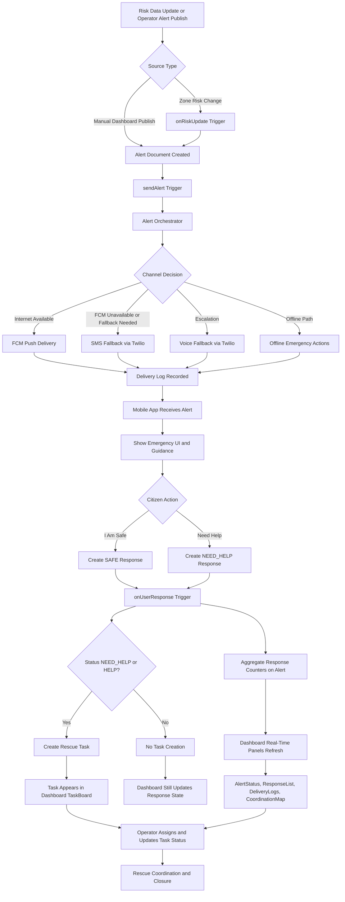

# PeopleFirst

PeopleFirst is a closed-loop disaster response platform built to connect authorities and citizens in real time.

It combines:
- A Firebase-powered backend for risk updates, alert orchestration, and response processing
- A Flutter mobile app for field users with offline emergency behavior
- A React dashboard for command-and-control operations

Core objective:
deliver alerts fast, capture citizen responses immediately, and convert distress signals into actionable rescue tasks.

## Repository Layout

Top-level directories:

- backend
  - Firebase Functions source, Firestore rules, deployment config
- dashboard
  - React operations dashboard
- mobile_app
  - Flutter app (Android, iOS, web, desktop targets)
- shared
  - Shared models and constants
- firestore
  - Local collection references and data scaffolding

Key files:

- firebase.json
- firestore.rules
- firestore.indexes.json
- RUNBOOK_DEMO.md
- REPO_MEMORY.md

## Architecture

### 1) Backend Layer (Firebase Functions + Firestore)

Main function entry:
- backend/functions/src/index.ts

Exported triggers:
- sendAlert (on alert document creation)
- onRiskUpdate (zone risk change trigger)
- onUserResponse (citizen response trigger)

Primary backend modules:
- backend/functions/src/modules/risk/riskEngine.ts
  - risk normalization/scoring and recommendation inputs
- backend/functions/src/modules/alerts/alertOrchestrator.ts
  - delivery orchestration across channels
- backend/functions/src/modules/alerts/fcmService.ts
  - primary push notifications
- backend/functions/src/modules/alerts/smsService.ts
  - Twilio SMS fallback (mock behavior when credentials are placeholder)
- backend/functions/src/modules/alerts/voiceService.ts
  - Twilio voice fallback (mock behavior when credentials are placeholder)
- backend/functions/src/modules/alerts/deliveryTracker.ts
  - delivery log events

Response-to-logistics flow:
- backend/functions/src/triggers/onUserResponse.ts
  - aggregates SAFE and NEED_HELP responses
  - creates rescue tasks for NEED_HELP responses
  - includes status normalization for both NEED_HELP and HELP

Task backfill utility:
- backend/functions/backfill_tasks_from_responses.js

### 2) Mobile Layer (Flutter)

App bootstrap:
- mobile_app/lib/main.dart

Core mobile services:
- notification_service.dart (FCM setup and listeners)
- connectivity_service.dart
- local_storage_service.dart
- offline_alert_service.dart

Offline emergency modules:
- siren_player.dart
- flash_alert.dart
- emergency_actions.dart
- local_rules_engine.dart

Field features:
- citizen login/navigation
- alert feed and response actions
- map and volunteer screens
- real-time dispatch/listener behavior

### 3) Dashboard Layer (React)

Main composition:
- dashboard/src/App.js

Included panels:
- AlertManager
- AlertStatus
- SummaryCards
- AlertList
- DeliveryLogs
- ResponseList
- CoordinationMap
- LogisticsDispatch
- TaskBoard

Data access pattern:
- Firestore onSnapshot streams through reusable hooks

## End-to-End Response Loop

1. Risk changes or alert publish action creates/updates alert context.
2. Backend trigger invokes alert pipeline.
3. Delivery is attempted via prioritized channel strategy.
4. Mobile clients receive and surface emergency guidance.
5. Users submit SAFE or NEED_HELP responses.
6. Backend aggregates responses and logs latest responder state.
7. NEED_HELP responses generate rescue tasks.
8. Dashboard streams alerts, responses, delivery logs, and tasks for operator action.

## System Workflow Flowchart

## Firestore Data Model

Primary collections:
- users
- alerts
- responses
- deliveryLogs
- tasks
- zones
- shelters

Security (current rule intent in backend/firestore.rules):
- alerts: authenticated read, backend-controlled writes
- responses: authenticated user-scoped create/read
- deliveryLogs: backend-only access
- tasks: authenticated read/update, backend-only create/delete
- default: deny all

## Technology Stack

- Backend
  - Node.js 20
  - TypeScript
  - firebase-admin
  - firebase-functions
  - twilio
- Dashboard
  - React 18
  - Firebase Web SDK
  - react-leaflet + leaflet
- Mobile
  - Flutter
  - firebase_core, firebase_auth, cloud_firestore, firebase_messaging
  - audioplayers, torch_light, geolocator, connectivity_plus

## Local Setup

### Prerequisites

- Node.js and npm
- Flutter SDK
- Firebase CLI
- Android device or emulator for mobile testing
- Access to Firebase project peoplefirst-791ef (or your own configured project)

### 1) Backend Functions

From backend/functions:

- npm install
- npm run build

Optional local emulation:

- npm run serve

### 2) Dashboard

From dashboard:

- npm install
- npm start

Production build:

- npm run build

### 3) Mobile App

From mobile_app:

- flutter pub get
- flutter run -d <device_id>

Useful diagnostics:

- flutter devices
- flutter analyze lib
- flutter test

## Deployment

From backend:

- firebase deploy --only functions,firestore:rules

Notes:
- If Twilio secrets are placeholders, SMS/voice modules remain in mock mode.
- For production fallback channels, configure valid TWILIO_ACCOUNT_SID, TWILIO_AUTH_TOKEN, and TWILIO_PHONE_NUMBER.

## Operational Runbook

Primary runbook:
- RUNBOOK_DEMO.md

Typical demo script:

1. Launch dashboard and mobile app.
2. Publish an alert from dashboard.
3. Verify alert appears in mobile.
4. Respond from mobile with NEED_HELP.
5. Confirm response and rescue task appear in dashboard.
6. Progress task status in TaskBoard.

## Current Status Snapshot

Implemented highlights:
- Real-time alert publishing and monitoring
- Multi-channel alert orchestration with fallback services
- Offline-capable mobile emergency behavior (siren/flash)
- Response aggregation and rescue task generation
- Dashboard coordination panels including logistics and task board
- Firestore security rules deployed and enforced

## Troubleshooting

Common issues and quick fixes:

- Flutter cannot find pubspec:
  - run commands from mobile_app directory
- Device not detected:
  - run flutter devices and reconnect USB/debug authorization
- Functions deploy fails during analysis:
  - ensure no SDK clients with strict credential validation are instantiated at module load time
- Dashboard shows no rescue tasks:
  - verify onUserResponse trigger deployment and tasks rules access

## Contribution Guidance

- Keep backend business logic modular in backend/functions/src/modules.
- Prefer trigger orchestration in backend/functions/src/triggers.
- Keep mobile offline behavior deterministic and locally testable.
- Maintain strict Firestore rules with least-privilege access.
- Update README and runbook whenever architecture or workflow changes.
